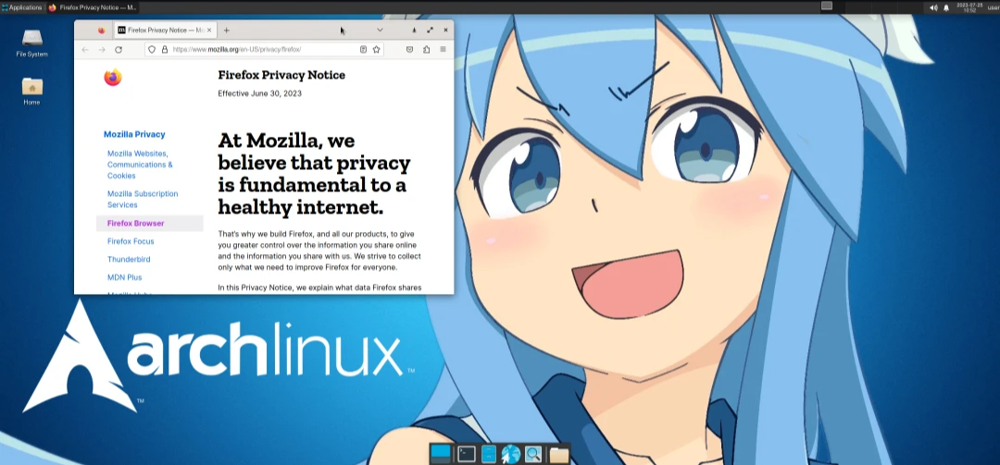
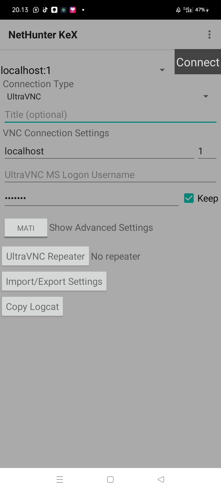

# new update 
---
- [x] fix sound 
- [x]fix eror install panel profil 
- [x]fix eror vncserver desktop 
---

# Arch-xfce
install arch linux xfce for android distro



## Installation

### Using the repo package:
```sh
pkg install wget -y ; wget https://raw.githubusercontent.com/PATRIX-CYBERGHOST01/Arch-xfce/main/arch.sh ; chmod +x arch.sh ; ./arch.sh
```
```sh
#how to use it:
1) arch
2) bash user.sh
3) exit
4) re-login arch / restart and login (type arch)
5) sudo bash xfce.sh

#fix panel profil
1) sudo pacman -S python-psutil
2) cd xfce4-panel-profiles
3) make
4) make install

```
Make sure you use zero termux and also nethunter kex

## setting nethunter kex :
```sh
1) ultravnc
2) remove title 
3) localhost:1 
4) your password 
```



by mr.patrix

team : cyber ghost⁰¹
